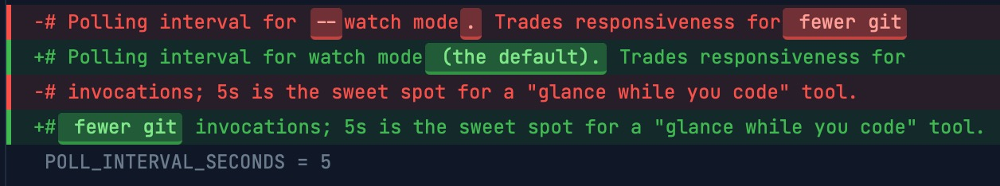

# git-dashboard

A **live-updating** browser-based git status dashboard with **word-level diff highlighting** for macOS. Single Python file, no framework, no dependencies beyond Python 3 and `git`.



## Why

Standard `git diff` is line-level. Change a single curly quote in the middle of a paragraph and the entire paragraph is marked red and green — you squint to find the actual change. Fine for code. Awful for prose.

This tool generates an HTML dashboard that highlights **exactly which words changed**, in color, inline. It's especially useful when:

- You're editing prose (long-form content, marketing copy, documentation, drafts).
- You're working with AI assistants (Claude Code, Cursor, etc.) and want to *see* what they actually changed in a file the moment they save it.
- You're reviewing commits before pushing and want a precise pre-commit read.

## The AI-assisted-editing use case

Leave `gd` open in a Terminal tab and a browser tab while you work with Claude Code or any other AI assistant. When the assistant edits a file, the dashboard auto-refreshes within seconds — you see exactly which words were added, removed, or changed.

This collapses verification from *"carefully re-read the whole paragraph to confirm the AI did what I asked"* to *"glance at the dashboard and confirm the colored words match your intent."*

## Install

Clone the repo and symlink to `~/bin/gd` for casual typing:

```bash
git clone https://github.com/scottschram/git-dashboard.git
cd git-dashboard
chmod +x git-dashboard.py
ln -s "$PWD/git-dashboard.py" ~/bin/gd
```

Make sure `~/bin` is on your `PATH`. Add to `~/.zshrc` (or `~/.bashrc`) if it isn't:

```bash
export PATH="$HOME/bin:$PATH"
```

Verify:

```bash
gd --help
```

## Usage

```bash
gd                              # watch mode (default) — opens browser, auto-refreshes
gd --once                       # one-shot snapshot — opens browser, exits
gd --range HEAD~3..HEAD         # show a commit range (implies --once)
gd --range HEAD~3               # range + uncommitted working tree changes
gd /path/to/other/repo          # point at a different repo
gd --help                       # full options
```

In watch mode the dashboard polls every 5 seconds. When the repo state changes (status, HEAD, staged content, unstaged content, or upstream tracking ref), the browser tab refreshes automatically. Ctrl-C to stop the server.

The one-shot modes (`--once`, `--range`) write the dashboard HTML to `/tmp/<repo-name>-git-dashboard.html` and open it via `file://`. Useful in scripts and CI; the browser tab is static and won't auto-refresh.

## Requirements

- macOS
- Python 3 (uses only the standard library — no `pip install`)
- `git`
- A browser (uses your system default)

## What the dashboard shows

- Branch + tracking status (ahead / behind remote, in sync, no remote)
- Last commit (hash, message, author, when)
- Files changed in working tree, with per-file status (modified, added, deleted, staged)
- Full diff of all changes, with **word-level highlighting** of additions, deletions, and substitutions within modified lines
- In `--range` mode: the same diff view, but for committed history rather than the working tree

## Following main while on a feature branch

When you're on any branch other than the default (`main`, `master`, etc.),
the right column splits into two stacked cards so you can spot when main has
moved underneath you:

- **⎇ Branch** — only the commits unique to your branch
  (`origin/main..HEAD`), capped at 12. The existing yellow highlight still
  marks unpushed commits.
- **📜 main** — recent commits on `origin/main` with a sync badge:
  - green `In sync with main` when your branch already contains everything on main
  - red `↓ N behind main` when collaborators have pushed commits you don't have
    yet. Those commits appear at the top of the list with a salmon highlight.
    The count is accurate even if more than 12 commits are behind (the list is
    capped; the badge is not).

The bottom card lists up to 12 entries, with at most 6 "already in your branch"
commits shown for orientation — the rest of the slots go to behind-by
commits. If you're more than 12 commits behind main, it's probably time to
rebase anyway.

The default branch is detected via `git symbolic-ref refs/remotes/origin/HEAD`,
so it works for repos using `master` or `trunk` too. In a no-remote / scratch
repo the dashboard falls back to a local `main` or `master` ref — useful when
two terminal sessions share a repo and one of them commits on main while you
work on a branch in the other. On the default branch itself, or in a repo
with no detectable default, the right column stays as a single
"📜 Recent Commits" card.

## Opening Finder and Terminal

In watch mode the header and the changed-file list are interactive:

- **Click the Path** in the header to open the repository folder in Finder.
- **Click the 🖥️ icon** next to the Path to open a terminal at the repository
  root — handy for running project scripts like `bin/verify deploy`.
- **Click any changed file** in the Working Tree Status panel to reveal that
  file in Finder, selected in its folder — handy for double-clicking it open in
  your editor, or in Preview for an image.

For safety, only the repository folder and files in the current change set can
be opened this way; nothing else is reachable.

The terminal launcher uses **Terminal.app** by default. To use a different
terminal, set the `GIT_DASHBOARD_TERMINAL` environment variable to its
application name — for example, `export GIT_DASHBOARD_TERMINAL=iTerm`.

Finder shows the folder in whatever view it's configured to use, and macOS
often defaults to Gallery or Icon view. If you'd rather land in **List view**,
set it as your Finder default: switch a Finder window to List view, open
**View Options** (⌘J), and click **Use as Defaults**.

These actions need the live server, so they work in watch mode only — the
static `--once` / `--range` snapshots render the path and filenames as plain
text.

## License

MIT — see [LICENSE](LICENSE).
